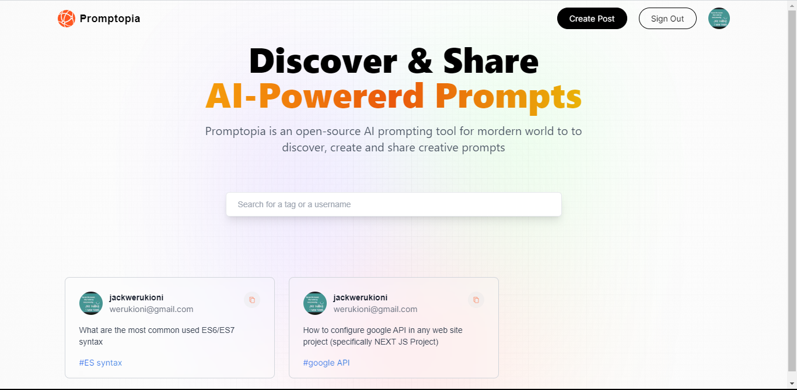
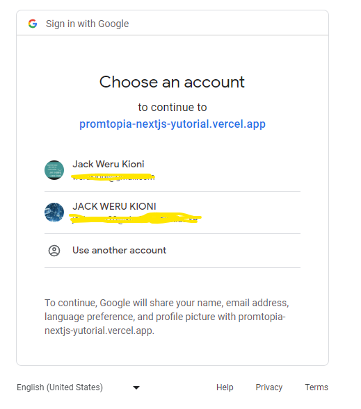
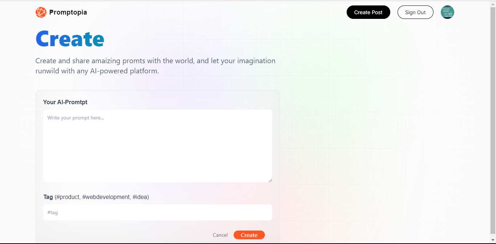
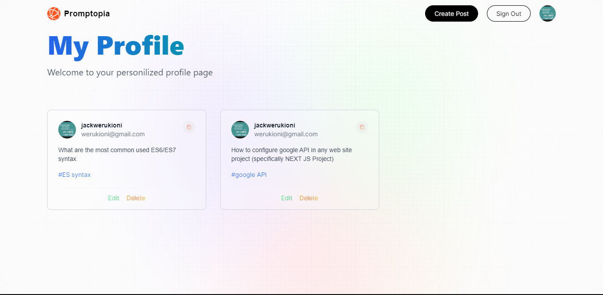

# Promptopia - NEXT JS APP

This solution is a next.js tutorial app. By functionality, it's an open-source AI prompting tool for mordern world to to discover, create and share creative prompts.

## Table of contents

- [Overview](#overview)
  - [Getting Started](#getting-started)
  - [Screenshot](#screenshot)
  - [Links](#links)
- [My process](#my-process)
  - [Built with](#built-with)
  - [What I learned](#what-i-learned)
  - [Continued development](#continued-development)
  - [Useful resources](#useful-resources)
- [Author](#author)
- [Acknowledgments](#acknowledgments)

## Overview

### Getting Started

First, run the development server:

```bash
npm run dev
# or
yarn dev
# or
pnpm dev
```

Open [http://localhost:3000](http://localhost:3000) with your browser to see the result.

This project uses [`next/font`](https://nextjs.org/docs/basic-features/font-optimization) to automatically optimize and load Inter, a custom Google Font.

### Screenshots






### Links

- Solution URL: [github repo](https://github.com/Jaweki/promtopia-nextjs_tutorial)
- Live Site URL: [deployment on vercel](https://promtopia-nextjs-yutorial.vercel.app/)

## My process

### Built with

- CSS custom properties
- Flexbox
- CSS Grid
- Mobile-first workflow
- [Tailwindcss](https://tailwindcss.com/)
- [React](https://reactjs.org/) - JS library
- [Next.js](https://nextjs.org/) - React framework

### What I learned

- Most important for such a project is to design with a mobile-first workflow. This app is responsive and allows dynamic rendering of content with UI design being variable to screen width.
  In much greater context, for a developer here is an example of achiving this with tailwindcss:

```js
export default function Component({ props }) {
    return (
        <div className="max-md:flex max-md:flex-col md:grid md:grid-cols-3 max-md:gap-3 md:gap-6 sm:gap-1">
            // ui being rendered
        <div>
    )
}
```

- This app employs the use of authentication mechanisms like, use of google provider, users can get to login or signup into their account using their google account. More about google provider click here to learn more about [Next Auth](https://next-auth.js.org/providers/google#options).

- Sure this app was a good practice on how to use mongoose adapter to get data from MongoDB as a database.

- This app has clean code that implements the use of APIs to fetch and post data to the backend.

### Continued development

To this point, there is no-more futher planned development in schedule, however if any developer or user of the app has a request, they can reach me at [my website - portfolio.jaweki.com](https://portfolio.jaweki.com).

### Useful rescources

- [Javascript Mastery - Youtube channel](https://jsmastery.pro) - This tutorial was learnt from that youtube channnel, thanks to Adrian the channels main content creator.
- [Chat GPT](https://chat.openai.com) - This helped understand some complex aspects of web development such as understanding device responsive apps, client side rendering in Next js and its contrast to SSR and ISR.
- [React developers channel on discord]() - This was very helpful to have a site were I could find help while developing, from fellow react developers.

## Author

- Website - [Jack Weru | Jaweki](https://portfolio.jaweki.com)

## Acknowledgements

Thanks so much to Adrian at [Javascript Mastery](https://jsmastery.pro), I got a chance to ramp up my web developer skills with react. Adrian has a cool way to write code while teaching (as in he literaly explains what every line of code does; way to go Adrian).
Am proud to also have made meaningful use of my time to learn this react in next.js via this tutotial.
Am greatful for the AI technology Chat GPT. it explains in detail difficult to undertand concepts, generates code samples to emphasise on discussions and more. Thanks to Open AI.

## Learn More

To learn more about Next.js, take a look at the following resources:

- [Next.js Documentation](https://nextjs.org/docs) - learn about Next.js features and API.
- [Learn Next.js](https://nextjs.org/learn) - an interactive Next.js tutorial.

You can check out [the Next.js GitHub repository](https://github.com/vercel/next.js/) - your feedback and contributions are welcome!

## Deploy on Vercel

The easiest way to deploy your Next.js app is to use the [Vercel Platform](https://vercel.com/new?utm_medium=default-template&filter=next.js&utm_source=create-next-app&utm_campaign=create-next-app-readme) from the creators of Next.js.

Check out our [Next.js deployment documentation](https://nextjs.org/docs/deployment) for more details.
